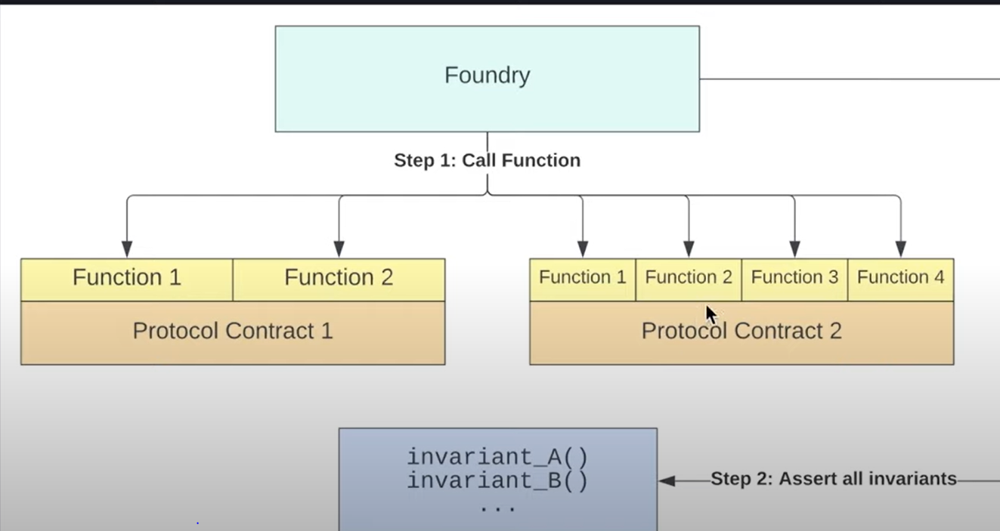

## Timestamp
22:51:59 DEFI Stablecoin Introduction
23:02:06 Code Walkthrough
23:05:11 What is a Stablecoin?(But actually)
23:33:29 DecentralizedStableCoin.sol
23:47:31 DSCEngine.sol Setup
23:57:37 Deposit collateral
24:15:38 Mint DSC: Getting the value of our collateral
24:32:02 Mint DSC: Health Factor
24:38:54 Mint DSC: Minting the DSC
24:40:16 Testing while developing: Deploy Script
24:55:12 Testing while developing: Testing
25:06:33 DSCEngine: depositCollateralAndMintDSC
25:09:01 DSCEngine: redeemCollateral
25:20:38 DSCEngine: Liquidate Setup
25:37:34 DSCEngine: Liquidate Refactoring
25:47:02 Sanity Check & Tests
26:04:34 Write some tests and Check for a glaring bug
26:06:28 Challenge: Get DSCEngine.sol test coverage above 85%
26:06:41 Level up your testing skills
   26:07:48 - Constructor tests repeated
   26:09:31 - PriceFeed Tests
   26:11:05 - Deposit Collateral tests
26:27:29 Fuzz(Invariant) Testing video
26:37:01 Open-Based Fuzz(Invariant) Tests

## DefiLlama

1. Liquid Staking
2. CDP Protocol 
3. Borrowing Lending protocol
4. DEX

## Places to learn

1. bankless
2. Metamask learn
3. [MEV(Miner Extractable Value)](https://docs.flashbots.net/new-to-mev)

## What is a Stablecoin?

1. A stablecoin is a crypto asset whose buying power fluctuates very little relative to the rest of the market
2. Buying power stays relative same
3. Why do we care??
   1. 3 functions of money
      1. storage of value
      2. unit of account
      3. medium of exchange
4. Categories of Stablecoin
   1. Relative stability(pegged/anchored or floating)
      1. Most popular pegged to Dollar
      2. Floating -> rai
   2. Stability method(governed or algorithmic)
      1. What is the mechanism?
      2. Revolves around minting or burning in a specific way?
      3. Algorithmic setup of code and DAO as well
      4. Could be hybrid system
      5. [Related Study](https://dirtroads.substack.com/p/-40-pruning-memes-algo-stables-are)
   3. Collateral Type(endogenous or exogenous)
      1. exogenous -> 
         1. outside(ie USDC -collateral being USD fail)
         2. Can scale but more math
      2. endogenous -> 
         1. inside(UST - Luna fail yes)
         2. Scale faster and easily
      3. Important questions wrt it
         1. Was the collateral created with the sole purpose of being collateral?
         2. Does the protocol own the issuance of underlying protocol
   4. Seignorage Shares model??

## Important stablecoins

1. DAI
2. USDC
3. USDT
4. RAI

## Who is minting and burning Stablecoin??

1. Leverage Investing
2. Margin trading
3. Most stablecoins exist due to leverage bet

## Curve.Finance 

1. Important understanding of curve finance and defi marketplace and stablecoin
2. AAVE and Curve stablecoin

## Fuzzing test

1. Stateless Fuzzing v/s Stateful fuzzing
2. Foundry fuzzing v/s Foundry invariant

## Invariant

1. Understand what invariants
2. Advance fuzzing -> trail of bits
3. Handler based testing is important for invariant testing 
   1. functions check the order of functions execution
   2. 